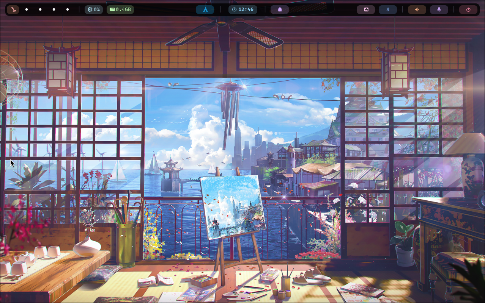
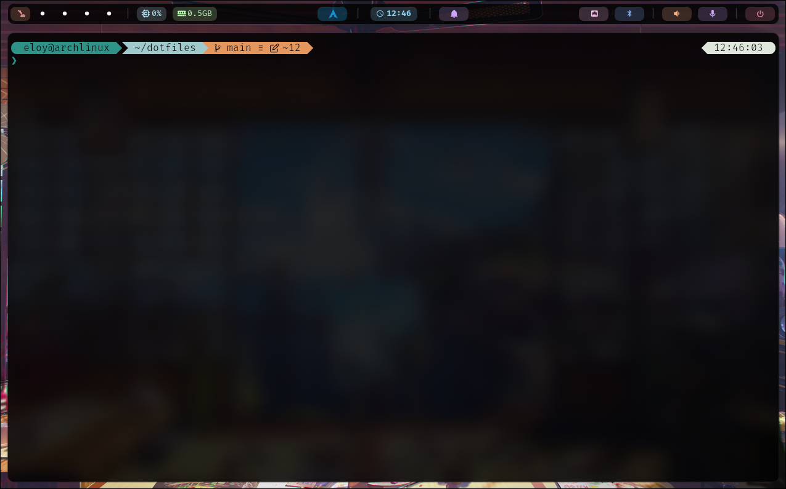
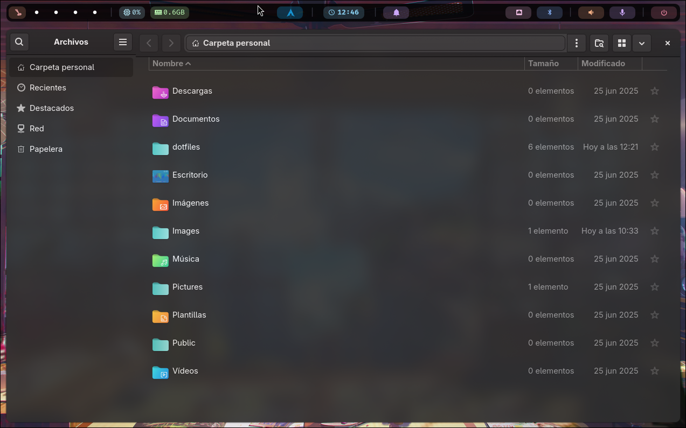
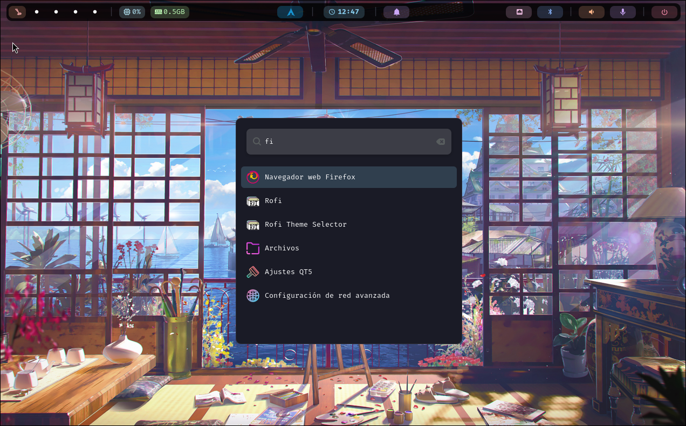

# Eloy's Arch Linux Dotfiles

A modern, elegant, and functional Hyprland configuration for Arch Linux.

## Screenshots

> **Note:** This repository is not maintained for the community. It is shared for reference and inspiration, but is intended for Eloy's personal use only.

| Overview                                       | Terminal                                       | Files                                    | Launcher                                       |
| ---------------------------------------------- | ---------------------------------------------- | ---------------------------------------- | ---------------------------------------------- |
|  |  |  |  |

## Overview

This repository contains my personal dotfiles for Arch Linux with Hyprland. The setup includes:

- **Hyprland**: A dynamic tiling Wayland compositor
- **Waybar**: Highly customizable status bar
- **Mako**: Lightweight notification daemon
- **Kitty**: Fast, feature-rich terminal emulator
- **Wofi**: Application launcher and menu
- **Zsh**: Shell with Oh My Posh for beautiful prompts

## Features

- Clean, modern design with consistent styling across all components
- Notification system with Do Not Disturb toggle
- Custom keybindings for efficient workflow
- Beautiful wallpapers and color schemes
- Optimized for productivity

## Installation

### Quick Install

Run the setup script to install all components:

```bash
chmod +x setup.sh
./setup.sh --all
```

### Selective Installation

_This repository no longer provides an interactive menu. Please use the quick install method above to install all components._

## Keybindings

| Keybinding                     | Action                         |
| ------------------------------ | ------------------------------ |
| Super + Return / T             | Open terminal                  |
| Super + Q                      | Close active window            |
| Super + M                      | Exit Hyprland                  |
| Super + E                      | Open file manager              |
| Super + V                      | Toggle floating mode           |
| Super + D                      | Open application launcher      |
| Super + P                      | Open power menu                |
| Super + W                      | Open wallpaper selector        |
| Super + N                      | Dismiss all notifications      |
| Super + Shift + N              | Toggle Do Not Disturb mode     |
| Super + Alt + N                | Notification history           |
| Super + Shift + 4              | Take screenshot                |
| Super + [1-5]                  | Switch to workspace [1-5]      |
| Super + Shift + [1-5]          | Move window to workspace [1-5] |
| Super + Tab / Mouse Down       | Next workspace                 |
| Super + Shift + Tab / Mouse Up | Previous workspace             |
| Super + Left/Right/Up/Down     | Move focus                     |
| Super + Mouse Drag             | Move/resize window             |
| XF86Audio\*                    | Audio controls                 |
| XF86MonBrightness\*            | Brightness controls            |
| XF86AudioNext/Prev/Play/Pause  | Media controls                 |

## Customization

Configuration files are organized by component in the `config/` directory:

- `config/hypr/`: Hyprland configuration
- `config/waybar/`: Waybar status bar
- `config/mako/`: Notification settings
- `config/kitty/`: Terminal configuration
- `config/wofi/`: Application launcher
- `config/scripts/`: Utility scripts

## Credits

- Wallpapers from [Wallhaven](https://wallhaven.cc/) by [lucasdt](https://wallhaven.cc/user/lucasdt) and [GreenFox](https://wallhaven.cc/user/GreenFox)

## License

MIT License
